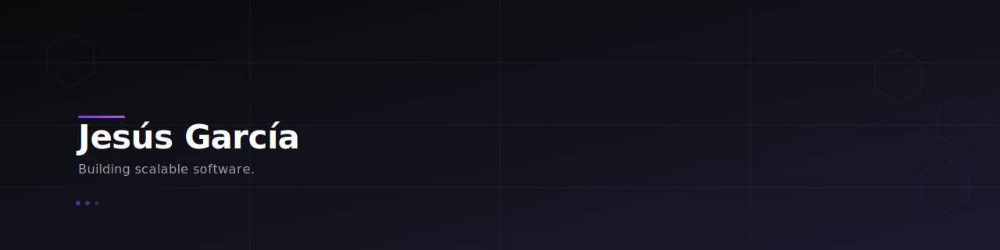

  

<h1 align="center">Jesús García (Plexor)</h1>

  <strong>Full Stack Developer</strong> • Building software that solves real problems.

  
  

---

### About

Soy desarrollador Full Stack con experiencia en construir aplicaciones web, herramientas de automatizaci��n y sistemas backend escalables. Actualmente construyendo Plexor — soluciones de automatización para pequeñas empresas.

---

### Tech Stack

  
  
  
  
  
  
  

---

### Featured Projects

- [Plexor](https://github.com/Plexor14pro/plexor-v5) — Plataforma de automatización: facturas, agendas, recordatorios y chatbot.
- [YouTube Downloader](https://github.com/Plexor14pro/youtube-downloader) — App de escritorio (GUI + CLI) para descargar videos de YouTube.

---

### GitHub Stats

  
  

  

---

### Connect

  
  
  

  <i>"Write code that matters."</i>

